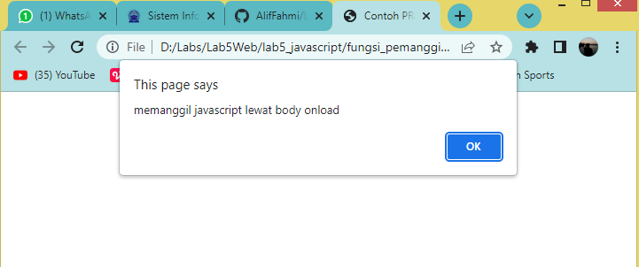

# Lab5Web
Latihan_4 6-4-2022

## Pengenalan JavaScript
Pengenalan javascript yang pertama adalah menulis javascript ke konsol browser menggunakan `console.log()`, membuat file html terlebih dahulu, kemudian masukan kodingan seperti ini

Tampilan website nya seperti ini, kemudian cek javascript nya dengan cara klik kanan -- inspect element -- console, kemudian akan tampil teks seperti yg tertera pada `console.log`

## Javascript Dasar

### javascript pemakaian alert sebagai property window
Membuat alert saat pada saat membuka halaman tab baru pada browser, kodingannya seperti ini

tampilan browser nya seperti ini

### Pemakaian method dalam objek
Membuat method seperti `document.write` pada object, contoh kodingannya seperti ini

tampilan browser nya seperti ini

### Pemakaian Prompt
Javascript untuk pemakaian prompt, kodinganya seperti ini

tampilan browser nya seperti ini

kemudian masukan nama, sebagai contoh saya memasukan nama Alif Fahmi, maka tampilanya akan berubah seperti ini

### Fungsi dan Cara Pemanggilan
Membuat javascript fungsi dan cara penggilanya, contoh kodingannya seperti ini

tampilan browser nya seperti ini

## Dasar Pemograman di Javascript

### Operasi dasar aritmatika
membuat operasi dasar aritmatika lewat javascript, contoh kodinganya seperti ini

tampilan browser nya seperti ini

Kemudian klik pada `aritmethic` kemudian akan tampil operasi dasar aritmatikanya

### Seleksi kondisi (if..else)
membuat logical if..else dengan javascript, contoh kodinganya seperti ini

tampilan browser nya seperti ini

kemudian coba kita masukan angka 0-100, disini saya akan memasukan angka 90, maka yg akan muncul tampilan lulus, sesuai dengan nilai if pada kodingan diatas

### Operator Switch
Membuat operator switch untuk seleksi kondisi, ontoh kodinganya seperti ini

tampilan browser nya seperti ini

kemudian coba masukan angka 4, maka tampilanya akan muncul bilangan empat, sesuai dengan kodingan diatas

## Pembuatan Form

### Form Input
Membuat form input menggunakan javasript, contoh kodinganya seperti ini

tampilan browser nya seperti ini

### Form Button
Membuat form button menggunakan javasript, contoh kodinganya seperti ini

tampilan browser nya seperti ini

kemudian coba klik pada button nya, disini saya coba klik pada `button latar belakang hijau` maka backgroound akan berubah warna hijau

